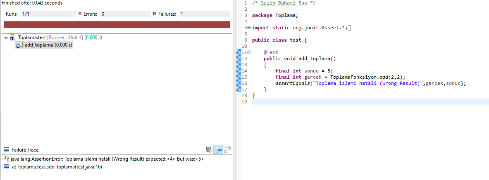

= Unit testing of basic Java Function
Salih Buhari Bas <buhari.bas@ogr.sakarya.edu.tr>
1.0, July 14, 2020

== Java Function:add

Adding two integer (2+2 at Figure 1)

.Image caption

=== Unit test (JUnit)

.Variables

*** int gercek : Result of the execution of add function
*** int sonuc:   The right result of that will be used to check if the function executes true result

==== Functions used

===== assertEquals("error message",int,int)

Is a function from JUnit that compares if the result of the function is equal to expected value.

====== add(int,int) of class FonksiyonToplama

adds two integers values and returns the result.

===== add_toplama(int,int) of class Test

Uses add() function and uses JUnit's assert equal to test

== How Unit Test gets executed

. JUnit & TestNG can be used

In Eclipse IDE (W10), From the Package Explorer, the project gets chosen first then Run As with TestNG or JUnit

For to unit testing outside IDE, Compile the Test class, navigate to src/ folder and run javac the compile the test.

* State vs Behavior Testing?

This Unit Testing is under "State Testing" as it does check the if the result is totally valid or not.

* Why assertEquals() is used?

Because it's much easier to display  error messages and it's also null safe unlike assertTrue().
